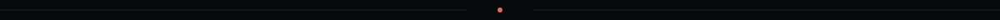
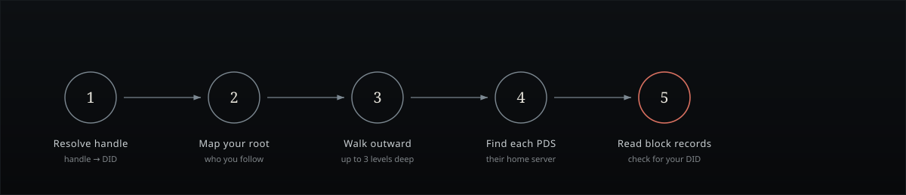

<div align="center">


<br/>

[](#-project-structure)
[](#-local-development)
[](#-how-it-works)
[](#-privacy--trust)
[](#-license)

**A quiet, client‑side audit of your Bluesky network -**
**to see who has blocked you, without the courtesy of telling you.**

[Live demo](#) · [How it works](#-how-it-works) · [Getting started](#-local-development) · [Deploy your own](#-deploying-to-github-pages)

</div>



## ✦ What this is

No one gets a notification when they're blocked on Bluesky. The relationship just… quietly ends. **The Excommunication Registry** is a small, honest tool that walks your extended network and checks, one public record at a time, who has shown you the door.

There's no login, no server, no database, and no tracking. Every request leaves your browser and goes straight to Bluesky's own public infrastructure, so this app never sees your data because it never touches a backend at all.

<table>
<tr>
<td width="25%" align="center">

**🔎**<br/>**Zero login**<br/><sub>Enter a handle, nothing else</sub>

</td>
<td width="25%" align="center">

**🛰️**<br/>**Zero backend**<br/><sub>Runs entirely in your browser</sub>

</td>
<td width="25%" align="center">

**🕸️**<br/>**Configurable reach**<br/><sub>Scan up to 3 levels deep</sub>

</td>
<td width="25%" align="center">

**🌐**<br/>**Bilingual UI**<br/><sub>English &amp; Persian, RTL‑aware</sub>

</td>
</tr>
</table>


## ✦ How it works

Bluesky block records (`app.bsky.graph.block`) live in the *blocker's own repository*, and AT Protocol repositories are public by design. That single fact is what makes this whole app possible.

<div align="center">

</div>

1. **Resolve your handle to a DID**, the stable identifier behind your `@handle`.
2. **Map your root network**, everyone you follow, excluded as candidates, since a block would normally sever a follow.
3. **Walk outward, depth by depth**, pulling followers and/or following at each level, according to the network reach you choose.
4. **Locate each account's PDS**, their personal home server on the network.
5. **Read their public block records**, checking, quietly, for your own DID among them.

> [!IMPORTANT]
> **A limitation worth knowing.** This can only see blocks from accounts reachable through the depth and relations you selected. There is no public "who has blocked me" index for all of Bluesky; sites that claim otherwise are running a 24/7 firehose indexer, which is simply not something a static, client‑only frontend can do. This tool trades completeness for honesty: everything it shows you, it can prove.


## ✦ Getting started

### Local development

```bash
npm install
npm run dev
```

That's it, the dev server starts, no environment variables or API keys required.

### Deploying to GitHub Pages

<table>
<tr><td width="36" align="center"><b>1</b></td><td>Push this repository to GitHub.</td></tr>
<tr><td align="center"><b>2</b></td><td>In your repo, go to <b>Settings → Pages → Build and deployment</b>, and set <b>Source</b> to <b>GitHub Actions</b>.</td></tr>
<tr><td align="center"><b>3</b></td><td>Push to <code>main</code>. The included workflow (<code>.github/workflows/deploy.yml</code>) builds and deploys automatically.</td></tr>
<tr><td align="center"><b>4</b></td><td>Your app goes live at <code>https://&lt;your-username&gt;.github.io/&lt;repo-name&gt;/</code>.</td></tr>
</table>

No environment variables, API keys, or secrets are ever needed. Every request travels directly from the visitor's browser to Bluesky's public endpoints, so nothing passes through a server you have to trust.


## ✦ Project structure

```text
src/
├─ types.ts                      Shared TypeScript interfaces
├─ i18n/                         Language context, translations, EN/FA copy
├─ services/
│  ├─ BlueskyApi.ts              Public AppView client (profiles, follows, followers)
│  ├─ DidResolver.ts             Resolves a DID to its PDS URL
│  ├─ BlockRecordReader.ts       Reads public block records straight from a PDS
│  ├─ BlockListFetcher.ts        Fetches and paginates block-related lists
│  ├─ AsyncPool.ts               Concurrency-limited task runner
│  └─ BlockScanner.ts            Orchestrates the configurable-depth network scan
├─ components/
│  ├─ ScanPanel.tsx              Live scan progress UI
│  ├─ ResultCard.tsx             Single result row
│  ├─ BlockedAccountRow.tsx      Row for a confirmed block
│  ├─ LedgerPanel.tsx            Historical scan ledger
│  └─ LanguageSwitcher.tsx       EN / FA toggle
├─ pages/
│  ├─ BlockersPage.tsx           Main scanning experience
│  └─ LedgerPage.tsx             Past results
└─ App.tsx                       Top-level routing and state
```


## ✦ Privacy &amp; trust

<table>
<tr><td width="28" align="center">🔒</td><td><b>No accounts, no login.</b> You never authenticate with anything, not this app, not Bluesky.</td></tr>
<tr><td align="center">🧾</td><td><b>No server, no storage.</b> There is nothing running behind this site that could log, retain, or leak a request.</td></tr>
<tr><td align="center">📡</td><td><b>Direct to the source.</b> Every call goes from your browser to Bluesky's public AppView and PDS endpoints, the same data anyone could read by hand.</td></tr>
<tr><td align="center">🕯️</td><td><b>Public by design.</b> This tool reveals nothing that AT Protocol doesn't already publish openly; it simply reads it faster than you could.</td></tr>
</table>


<div align="center">

### ✦ License

Released under the [MIT License](LICENSE).

<sub>Built on the open, public-by-design nature of the AT Protocol.</sub>

</div>
